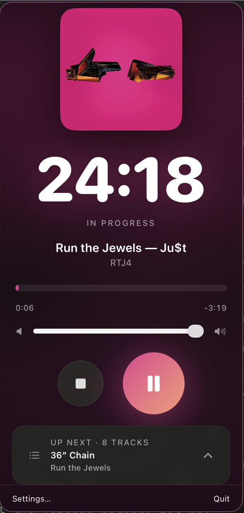
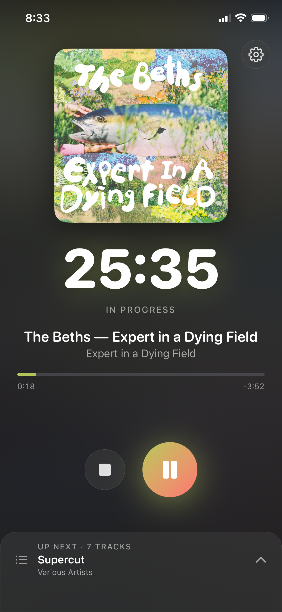

# Playdoro

A Pomodoro timer that plays music from your Plex library. Pick a seed track,
set a focus length, and Playdoro builds a shuffled playlist of similar tracks
that fills the session as tightly as possible — downloading and caching audio
ahead of time so playback never stalls.

Runs as a **macOS menu-bar app** and an **iOS app** from a single Swift
codebase (`PlaydoroKit`).

> **Renamed:** this was formerly *Plexodoro*. The codebase, repository, and
> bundle IDs now use *Playdoro*; Plex remains the music provider for now.

## Screenshots

| macOS menu bar | iOS active session |
| :---: | :---: |
|  |  |

## Features

- **Pomodoro engine** — two-phase track-packing algorithm (lookahead random +
  greedy fill) that targets an exact focus duration from a seed track's
  "nearest" neighbours.
- **Plex playback** — OAuth PIN flow against `plex.tv`, automatic server
  discovery, and direct streaming from your LAN server. Self-signed certs are
  supported (see [Security](#security)).
- **On-disk LRU cache** — tracks download sequentially to a bounded cache
  (default 500 MB) before playback starts, and persist across sessions.
- **Headphone EQ** — ~880 AutoEQ parametric presets (oratory1990 + Kazi)
  bundled as resources, searchable by headphone model, with a hard-bypass
  toggle that remembers your selection.
- **Background audio (iOS)** — playback survives screen lock, sleep, and audio
  route swaps via `AVAudioSession` interruption + configuration-change
  handling.
- **Provider-agnostic core** — `MusicProvider` protocol abstracts search,
  stream URLs, and session, so `PomodoroEngine` and `AudioPlayer` work
  unchanged for any future provider (Spotify, Tidal, …).

## Requirements

- macOS 14+ / iOS 17+
- Xcode 16+ / Swift 6.2 toolchain
- A [Plex Media Server](https://www.plex.tv/) with a music library
- (Optional) An Apple Developer account for device builds

## Build

### macOS (Swift Package Manager)

```bash
git clone <repo-url> && cd playdoro
swift run Playdoro        # build + launch the menu-bar app
```

Or open `Package.swift` in Xcode and run the `Playdoro` scheme.

### iOS

The iOS app is a separate Xcode project in `iOSApp/` that links the local
`PlaydoroKit` package.

```bash
# Simulator
xcodebuild -project iOSApp/Playdoro.xcodeproj -scheme Playdoro \
  -destination "platform=iOS Simulator,name=iPhone 16 Pro" build

# Device — open iOSApp/Playdoro.xcodeproj in Xcode,
# set your Signing & Capabilities team, then build & run.
```

> **Note:** the iOS project references `PlaydoroKit` pinned to `branch = main`.
> Changes to `Sources/PlaydoroKit/*` only reach the iOS build once committed to
> `main`. See `AGENTS.md` for the full SPM-resolution gotchas.

### Tests

```bash
swift test
```

XCTest suites cover the packing engine, the track cache (eviction + LRU
ordering), and the AutoEQ preset parser.

## How it works

```
SearchBar (seed track)
        │
        ▼
   AppState ──▶ MusicProvider (PlexClient) ──▶ Plex HTTP API
        │              │
        │              ▼
        │        PomodoroEngine (pack tracks to target duration)
        │              │
        ▼              ▼
   AudioPlayer ◀── TrackCache (on-disk LRU)
        │
        ▼
   AVAudioEngine ── AudioEQ (AutoEQ presets) ──▶ output
```

- **`PlexClient`** (`actor`, conforms to `MusicProvider`) — Plex HTTP API with
  search, "nearest neighbour", session lookup, and stream-URL resolution.
- **`PomodoroEngine`** (value-type struct) — packs tracks into a target
  duration: a randomised lookahead pass followed by a greedy fill.
- **`AudioPlayer`** (`@MainActor`) — wraps `AVAudioEngine` + `AVAudioPlayerNode`,
  downloading each track via `TrackCache` ahead of playback.
- **`AudioEQ`** — manages an `AVAudioUnitEQ`, loads AutoEQ presets, and supports
  a hard-bypass toggle that remembers the selected preset.

## AutoEQ presets

The headphone EQ presets under `Sources/PlaydoroKit/Resources/EQPresets/` are
sourced from the [AutoEQ](https://github.com/jaakkopasanen/AutoEq) project
(commit `7ae0f56`, 2025-07-20) — 879 `ParametricEQ.txt` files from oratory1990
(736) and Kazi (143). All credit for the measurements and corrections belongs
to those authors; see their repo for licensing and methodology.

## Security

Plex servers on a LAN commonly present self-signed TLS certificates.
`CertDelegate.swift` handles this with two safeguards:

- **Validation is only relaxed for private/LAN hosts** (RFC1918, loopback,
  link-local, `.local`). All public hosts — `plex.tv`, the relay,
  `*.plex.direct`, anything else — get normal system certificate validation.
- **Trust-on-first-use (TOFU) pinning.** On the first connection to a LAN host
  the SHA-256 of the server's public key is recorded and pinned. Subsequent
  connections must present the same key, which defeats MITM after the first
  pairing. A mismatch (possible MITM or server key rotation) rejects the
  connection; disconnect and reconnect to re-pair.

Tokens (Plex auth token, generated client ID) live only in `UserDefaults` and
are never hardcoded or logged in full.

## Project layout

| Path                                        | Role                                                   |
| ------------------------------------------- | ------------------------------------------------------ |
| `Sources/PlaydoroKit/`                      | Shared library — app, views, networking, audio, engine |
| `Sources/Playdoro/`                         | macOS executable thin entrypoint                       |
| `iOSApp/Playdoro/`                          | iOS Xcode project (separate `.xcodeproj`)              |
| `Tests/PlaydoroTests/`                      | XCTest suites                                          |
| `Sources/PlaydoroKit/Resources/EQPresets/`  | Bundled AutoEQ preset files                            |

## License

[MIT](LICENSE) — © Mathew Hartley. The bundled AutoEQ presets under
`Sources/PlaydoroKit/Resources/EQPresets/` remain under their upstream
licenses; see the [AutoEQ project](https://github.com/jaakkopasanen/AutoEq).